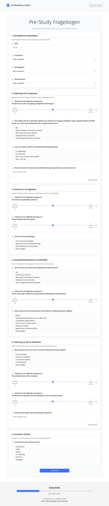
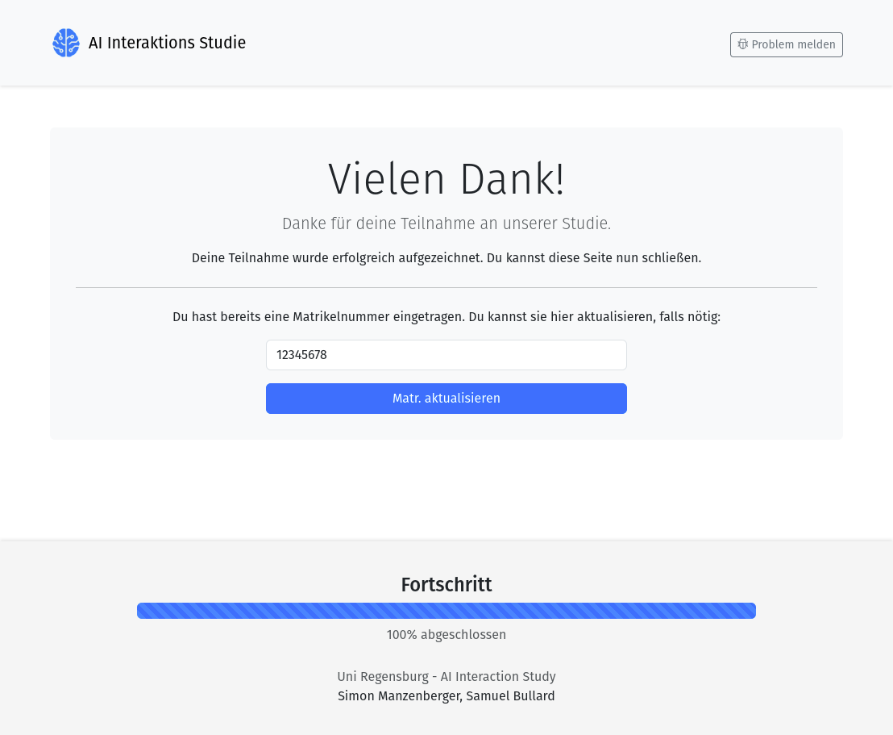

# Interacting_with_AI_Systems_WS2024-25
GitHub Repository for Submission for the University course "Interacting with AI Systems" WS2024/25.

# Study: The Effects of Response Latency, Response Complexity, and Their Interaction on the Perceived Quality of AI-Generated Health Advice

**Authors:** Samuel Bullard & Simon Manzenberger  
**Affiliation:** Information Science Faculty, University of Regensburg

---

## Project Overview

This repository accompanies an experimental study investigating how response latency (Fast vs. Slow) and response complexity (Easy vs. Hard) influence user trust in AI-generated health advice.

The study utilized a 2x2 within-subjects design implemented via a custom web application. Participants (N=39) interacted with a simulated AI across four health scenarios, rating the perceived trustworthiness and quality of the responses under different experimental conditions.

The primary goal was to examine the main effects of latency and complexity, as well as their interaction effect, on perceived quality perception focusing on trustworthiness along with other metrics.

---

## Repository Contents & Availability

This repository contains the following main components:

*   `frontend`: The user interface for the study.
*   `backend`: The FastAPI server handling requests.
*   `gradio_app`: The Gradio application for the core study interaction (latency/complexity).
*   `results`: Anonymized participant data, analysis scripts, and generated figures.
*   `deployment-modules`: Configuration and scripts for deploying the application.
*   `firebase-administration-scripts`: Scripts for managing Firebase data related to the study.

---

## Study Data

The anonymized raw data collected from the study participants can be found in the `study-project/results/data/` directory. Each subdirectory within represents a single participant, identified by a unique ID.
This data includes:
*   Responses from the main study interaction (handled by the Gradio app).
*   Data from the pre-study and post-study questionnaires.
*   Other technical metrics

---

## Screenshots

<!-- Using HTML for better control over image size and layout -->
<table>
  <tr>
    <td align="center">Start Page</td>
    <td align="center">Consent</td>
    <td align="center">Pre-Study Questionnaire</td>
  </tr>
  <tr>
    <td></td>
    <td></td>
    <td></td>
  </tr>
  <tr>
    <td align="center">Token Entry</td>
    <td align="center">Explanation</td>
    <td align="center">Main Study Interface</td>
  </tr>
  <tr>
    <td></td>
    <td></td>
    <td></td>
  </tr>
   <tr>
    <td align="center">Main Study (Streaming)</td>
    <td align="center">Bug Report Modal</td>
    <td align="center">Post-Study Questionnaire</td>
  </tr>
  <tr>
    <td></td>
    <td></td>
    <td></td>
  </tr>
  <tr>
    <td align="center">Study Finish</td>
    <td align="center">Finish (Update Matrikelnummer)</td>
    <td align="center">Finish (Update Error Handling)</td>
  </tr>
  <tr>
    <td></td>
    <td></td>
    <td></td>
  </tr>
</table>

---

## Setup & Configuration

To run the project locally, you need to configure the environment variables. You need to create the following files manually:

1.  **Backend `.env` file:** Create a file named `.env` inside the `study-project/backend/` directory with the following variables:
    ```
    FIREBASE_CREDENTIALS_PATH=/path/to/your/firebase_adminsdk_key.json
    STATIC_FILES_DIR=/path/to/study-project/frontend/dist # Adjust if needed
    MAILGUN_API_KEY=<your_mailgun_api_key>
    MAILGUN_DOMAIN=<your_mailgun_domain>
    RECIPIENT_EMAIL=<your_email_for_bug_reports>
    IMGBB_API_KEY=<your_imgbb_api_key>
    ```

2.  **Firebase Admin SDK Key:** Place your Firebase service account key file (e.g., `firebase_adminsdk_key.json`) in the location specified by `FIREBASE_CREDENTIALS_PATH` in the backend `.env` file.

Replace the placeholder values (e.g., `<your_mailgun_api_key>`) with your actual keys and paths.
